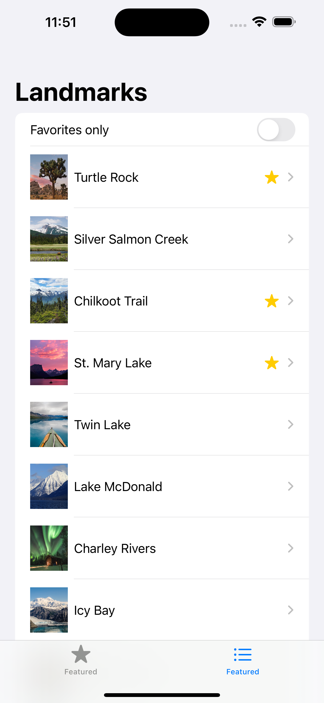
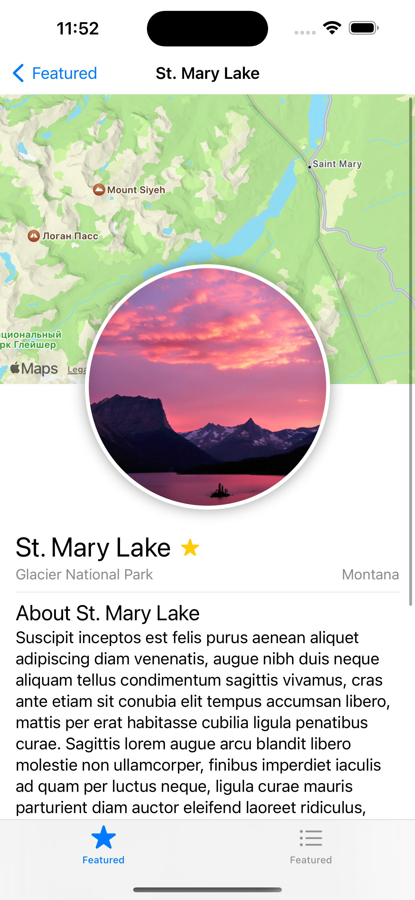
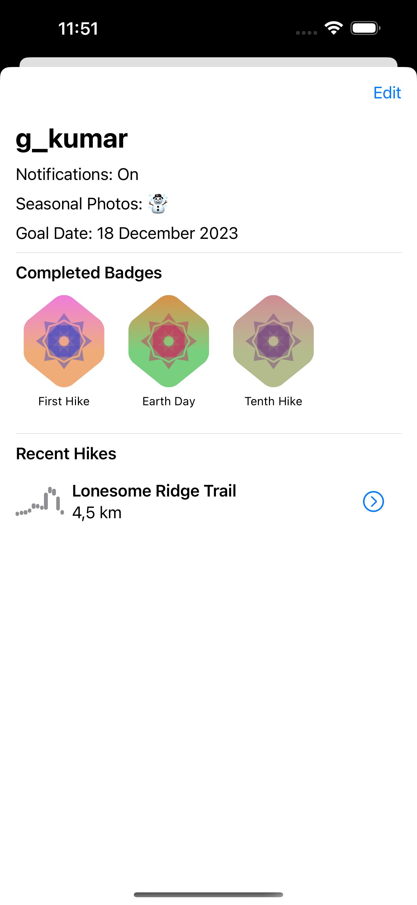

#  Landmarks

This is a simple app for saves and sharing your favourite places.
App created with SwiftUI. You can view detail information about landmarks and also located them on Map. On Profile screen you can view and edit profile's data.

_This project was created according to Apple's tutorials._
